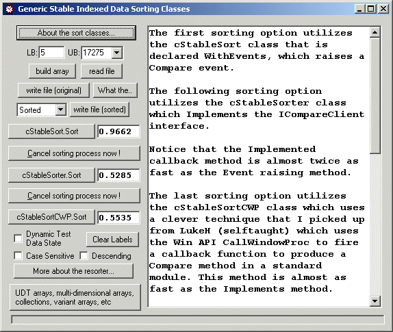



## A generic stable indexed data sorting class

### Description

With this generic solution you can sort any data that is stored in an indexed data storage structure such as lists, collections, and arrays of all data types, including multi-dimensional arrays and arrays of UDTs ...

Three methods are demonstrated - Event raising WithEvents, an Implemented callback, and a clever CallWindowProc technique I picked up from LukeH (selftaught) ...

The Implemented callback method is almost twice as fast as the Event raising method, and is also slightly faster than the CallWindowProc method ...

This is a complete solution that allows you to cancel sorting within the Compare routine, and also a progress parameter that indicates the percentage completed as a long value of 1 to 100. These features are included in the demo ...

Update 21 Feb 2008 tweaked a little speed and attempted to create a level performance test between the CWP method and the other two - now just a few 100ths of a second behind the Implemented method ...

Obscure Bug Fix 7 March 09. I documented they 'can sort sub-sets of the array data' but with these indexed versions if you do an error *could* occur without this very small change.
 
### More Info
 

             |
---                |---
**Submitted On**   |2008-08-10 12:43:28
**By**             |[Rde](https://github.com/Planet-Source-Code/PSCIndex/blob/master/ByAuthor/rde.md)
**Level**          |Intermediate
**User Rating**    |5.0 (70 globes from 14 users)
**Compatibility**  |VB 4\.0 \(32\-bit\), VB 5\.0, VB 6\.0
**Category**       |[Data Structures](https://github.com/Planet-Source-Code/PSCIndex/blob/master/ByCategory/data-structures__1-33.md)
**World**          |[Visual Basic](https://github.com/Planet-Source-Code/PSCIndex/blob/master/ByWorld/visual-basic.md)
**Archive File**   |[A\_generic\_214612372009\.zip](https://github.com/Planet-Source-Code/rde-a-generic-stable-indexed-data-sorting-class__1-65107/archive/master.zip)

### Source Code

<BLOCKQUOTE>

 
<H2 ALIGN="center">Generic Sorting Classes</H2>

You can sort any data that is stored in an indexed data storage structure such as lists, collections, and arrays of all data types, including multi-dimensional arrays and arrays of UDTs.

It is up to you to write the comparison code needed in the exposed Compare routine to suit your particular storage structure and data type.

This is actually the best approach as it hides all the sorting details and leaves you to handle only the comparison code relavant to your current data implementation and desired sort criteria.

This is not intended to be a treatise on sorting multi-dimensional arrays or arrays of UDT's, if this is what you need then psc has has some very good examples on these subjects.

This is intended as a straighforward sorting solution that may be useful if you have a specific need to sort an indexed data structure, and you would like the sorting details to be hidden, and the sorting class's usage to be as simple and as generic as possible.

Each class header has clear instructions on how to implement that particular solution, and this form's code also demonstrates the usage of each sorting class without complicating it with data implementation details.

<H3 ALIGN="center">Free Usage</H3>

As usual, you are free to use any part or all of this code even for commercial purposes in any way you wish under the one condition that no copyright notice is moved or removed from where it is.

Happy coding :)

...

</BLOCKQUOTE>

